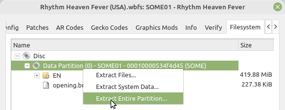
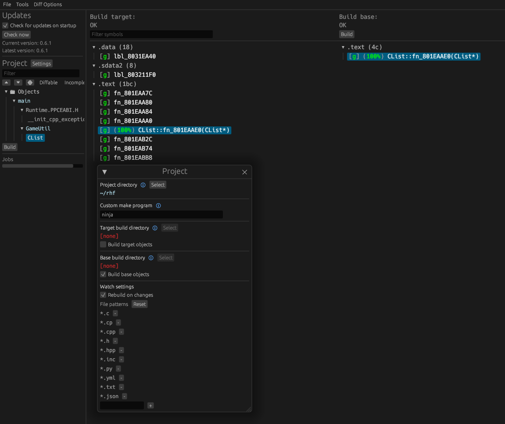

Rhythm Heaven Fever 
[![Discord Badge]][discord]
=============


[Discord Badge]: https://img.shields.io/discord/277545487375007744?color=%237289DA&logo=discord&logoColor=%23FFFFFF
[discord]: https://discord.gg/ps4rq53

A work-in-progress decompilation of Rhythm Heaven Fever.

Supported versions:

- `SOME01`: USA

Dependencies
============

Windows:
--------

On Windows, it's **highly recommended** to use native tooling. WSL or msys2 are **not** required.  
When running under WSL, [objdiff](#diffing) is unable to get filesystem notifications for automatic rebuilds.

- Install [Python](https://www.python.org/downloads/) and add it to `%PATH%`.
  - Also available from the [Windows Store](https://apps.microsoft.com/store/detail/python-311/9NRWMJP3717K).
- Download [ninja](https://github.com/ninja-build/ninja/releases) and add it to `%PATH%`.
  - Quick install via pip: `pip install ninja`

macOS:
------
- Install [ninja](https://github.com/ninja-build/ninja/wiki/Pre-built-Ninja-packages):
  ```
  brew install ninja
  ```
- Install [wine-crossover](https://github.com/Gcenx/homebrew-wine):
  ```
  brew install --cask --no-quarantine gcenx/wine/wine-crossover
  ```

After OS upgrades, if macOS complains about `Wine Crossover.app` being unverified, you can unquarantine it using:
```sh
sudo xattr -rd com.apple.quarantine '/Applications/Wine Crossover.app'
```

Linux:
------
- Install [ninja](https://github.com/ninja-build/ninja/wiki/Pre-built-Ninja-packages).
- For non-x86(_64) platforms: Install wine from your package manager.
  - For x86(_64), [WiBo](https://github.com/decompals/WiBo), a minimal 32-bit Windows binary wrapper, will be automatically downloaded and used.

Building
========

- Clone the repository:
  ```
  git clone https://github.com/EstexNT/rhf.git
  ```
- Using [Dolphin Emulator](https://dolphin-emu.org/), extract your game to `orig/SOME01`.

  - To save space, the only necessary files are the following. Any others can be deleted.
    - `sys/main.dol`
    - `files/EN/content2/rev_tengoku.brsar`
    - all files in the directory: `files/EN/content2/cellanim`
- Configure:
  ```
  python configure.py
  ```
  To use a version other than `SOME01` (USA), specify it with `--version`.
- Build:
  ```
  ninja
  ```

Diffing
=======

Once the initial build succeeds, an `objdiff.json` should exist in the project root. 

Download the latest release from [encounter/objdiff](https://github.com/encounter/objdiff). Under project settings, set `Project directory`. The configuration should be loaded automatically. 

Select an object from the left sidebar to begin diffing. Changes to the project will rebuild automatically: changes to source files, headers, `configure.py`, `splits.txt` or `symbols.txt`.


